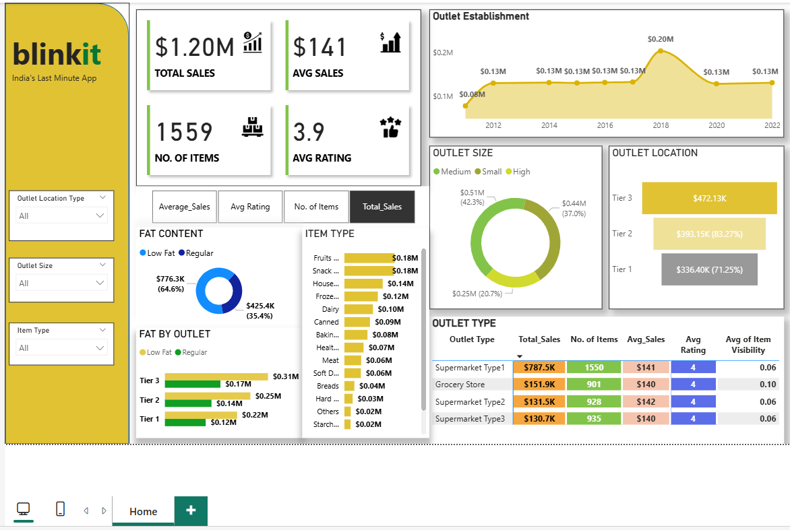

# 🛒 Blinkit Outlet Performance Dashboard — Power BI

An interactive Power BI dashboard built to analyze **Blinkit's outlet performance**, including sales trends, outlet types, item categories, fat content, and overall business performance.

The dashboard enables business stakeholders to evaluate **high-performing outlets**, understand **sales drivers**, and explore **customer rating patterns** for informed decision-making.

---

## 🔍 Project Summary

- **Objective:** Provide a unified view of Blinkit’s outlet-level sales and performance.  
- **Audience:** Business leaders, sales teams, category managers, and data analysts.  
- **Data Source:** Excel dataset — `BlinkIT Grocery Data.xlsx`  
- **Scope:** Covers outlet type, item category, fat content, establishment year, and sales performance.

---

## 📊 Dashboard Overview

### 🏠 Main Dashboard

---

## 🎯 Key Insights

| KPI | Description |
|------|--------------|
| **Total Sales:** $1.20M | Overall revenue generated from all outlets |
| **Average Sales:** $141 | Mean sales value across items |
| **Number of Items:** 1559 | Total items sold across outlets |
| **Average Rating:** 3.9 | Average customer rating |

### Additional Insights

#### 🏬 **Outlet Performance**
- **Tier 3 outlets** lead with **$472K** in total sales.  
- **Supermarket Type 1** contributes the highest sales: **$787.5K**.
- Outlets established in **2018** show a noticeable performance peak.

#### 🍱 **Item & Fat Content Analysis**
- **Low Fat products** contribute **64.6%** of total sales.
- Top-selling item categories include:  
  - Fruits  
  - Snacks  
  - Household  
  - Frozen foods  

#### 📍 **Outlet Segmentation**
- **Outlet Size Distribution:** Medium, Small, and High contribute differently to sales.
- **Outlet Location:** Strong revenue contribution from Tier 2 and Tier 3 cities.

---

## 🧭 Dashboard Pages

### **1️⃣ Performance Overview Page**
- KPI summary cards  
- Sales trend by establishment year  
- Donut charts for outlet size  
- Fat content comparison  
- Item type contribution  
- Outlet type performance summary  

### **2️⃣ Filters Panel**
- Item Type  
- Outlet Type  
- Outlet Size  
- Outlet Location Type  

---

## 🛠️ Tools & Technologies

| Tool / Technology | Purpose |
|--------------------|----------|
| **Power BI Desktop** | Dashboard development |
| **Power Query** | ETL: cleaning & transforming data |
| **DAX (Data Analysis Expressions)** | KPIs & calculated measures |
| **Excel (BlinkIT Grocery Data.xlsx)** | Data source |
| **Git & GitHub** | Version control and portfolio hosting |

---

## 🧮 Data Model Overview

**Fact Table:** Sales and outlet records  
**Dimensions:**  
- Item Type  
- Fat Content  
- Outlet Type  
- Outlet Size  
- Outlet Location  
- Establishment Year  

---

## 📂 Repository Structure

Blinkit-Outlet-Performance-Dashboard-PowerBI/
│
├── data/
│ └── BlinkIT Grocery Data.xlsx
│
├── images/
│ └── dashboard-overview.png
│
├── pbix/
│ └── blinkit-outlet-performance-dashboard.pbix
│
├── .gitignore
├── LICENSE
└── README.md

---

## 🚀 How to Use

1. Clone or download this repository:  
 git clone https://github.com/kartikarora328/Blinkit-Outlet-Performance-Dashboard-PowerBI
2. Open the Power BI file from:  
**pbix/blinkit-outlet-performance-dashboard.pbix**  
3. If prompted for data connection:  
- Go to **Transform Data → Data Source Settings → Change Source**  
- Select your local path for **BlinkIT Grocery Data.xlsx**  
4. Refresh the data and explore the dashboard interactively.

---

## 📈 Skills Demonstrated

- Power BI dashboard design  
- DAX measure creation  
- Data modeling  
- ETL using Power Query  
- Business insights & storytelling  
- Excel-based data preparation  
- GitHub documentation & code management  

---

## ⚙️ Future Enhancements

- Add a detailed **drill-through report** at outlet level  
- Add **month-over-month** or **year-over-year** comparison  
- Introduce **forecasting using Power BI AI visuals**  
- Add a **customer sentiment** section if data becomes available  

---

## 👨‍💻 Author

**Harsh Arora**  
📧 kartikarora328@gmail.com  
🔗 [LinkedIn](https://www.linkedin.com/in/harsh-arora-80445167)

---

⭐ **Acknowledgment**  
Dataset used for educational and project demonstration purposes.

---

## 📜 License
This project is licensed under the MIT License.  
See the **LICENSE** file for more details.

---

## ✅ Metadata Summary

| Field | Details |
|--------|----------|
| **Project** | Blinkit Outlet Performance Dashboard - Power BI |
| **Author** | Harsh Arora |
| **Created** | November 2025 |
| **Tool** | Microsoft Power BI |
| **Category** | Data Visualization / Analytics |
| **License** | MIT |
| **Dataset Source** | BlinkIT Grocery Data.xlsx |
| **Status** | Completed |

